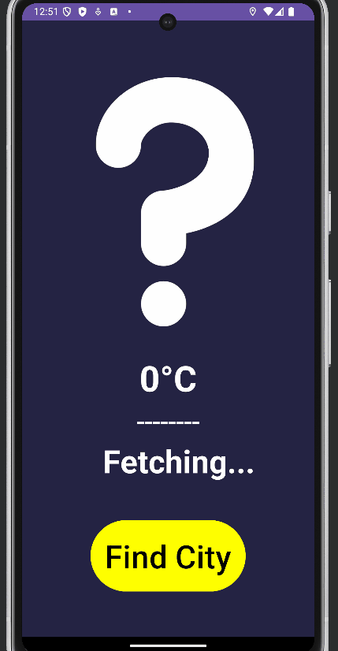

# Weather App 🌤️

A simple and elegant android weather app that fetches real-time weather data using the OpenWeatherMap API.

---

## Features ✨
- **Real-Time Weather Data**: Get current weather conditions for any city.
- **Location-Based Weather**: Automatically detect the user's location and display the weather.
- **Search by City**: Search for weather information by city name.
- **Beautiful UI**: Clean and intuitive user interface.

---

## Demo 🎥
  

---

## Technologies Used 🛠️
- **Android Studio**: For app development.
- **OpenWeatherMap API**: For fetching weather data.
- **Java**: Primary programming language.
- **AsyncHttpClient**: For making HTTP requests.

---

## Setup Instructions 🚀

### Prerequisites
- Android Studio.
- An API key from OpenWeatherMap

### Steps to Run the Project
1. **Clone the Repository**:
   ```bash
   git clone https://github.com/pablomoreno10/WeatherApp2.0.git
